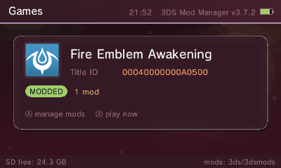
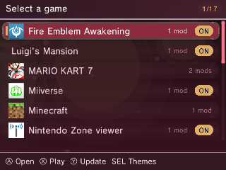
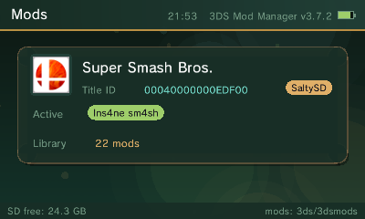
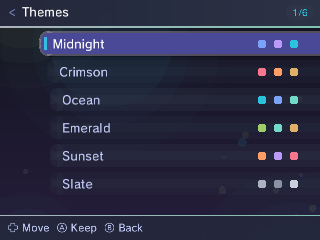

# 3DS Mod Manager

A homebrew mod manager for the Nintendo 3DS that hot-swaps game mods on the
console itself — no PC required after setup. Built with libctru + citro2d.
Works on every model (old/New 3DS/2DS) with Luma3DS. MIT licensed.

## Screenshots

| Game view (Crimson theme) | Game list |
| --- | --- |
|  |  |

| Smash mods (Emerald + SaltySD) | Theme picker |
| --- | --- |
|  |  |

## Install (any CFW 3DS, old and New models)

1. Download `3dsmods.cia` from the
   [latest release](https://github.com/Felipezwp/3ds-mod-manager/releases/latest)
   and install it with FBI. Requirements: Luma3DS with **game patching
   enabled** (hold SELECT at boot to check).
2. From then on the app updates itself: it checks for releases at boot and
   pressing Y installs them. Updates are RSA-signed and verified on-device
   before installing.
3. Optional: UI sounds need your console's dumped DSP firmware
   (`sdmc:/3ds/dspfirm.cdc`, dump with the DSP1 homebrew) — without it the
   app simply runs silent.

Mods go in `sdmc:/3ds/3dsmods/<TitleID>/<mod name>/` (the folder is created
on first run). For Smash, see the SaltySD notes below — the in-app
**SaltySD loader** entry (bottom of Smash's mod list) lets you pick which
`code.ips` to use if the default crashes.

## What it does

Games on the 3DS load mods in two very different ways, and this app handles
both behind one UI:

- **Most games (Luma LayeredFS):** the active mod lives in
  `sdmc:/luma/titles/<TitleID>/` and file reads are redirected by Luma.
- **Super Smash Bros. 3DS (SaltySD):** Smash packs its data inside `dt`/`ls`
  archives, so LayeredFS can't replace individual files. A `code.ips` patch
  (SaltySD) redirects reads to `sdmc:/saltysd/smash/` instead. The manager
  keeps that loader alive (self-healing from a pristine copy) and un/re-wraps
  each mod's `romfs/` layout when swapping, since SaltySD expects the data
  folders at the top level.

Mods are stored centrally in `sdmc:/3ds/3dsmods/<TitleID>/<mod name>/` and
swapped by folder *moves* (rename), so switching is instant and nothing is
ever deleted.

## Features

- Game list with real icons + names read from each installed title's SMDH
  (works for SD, NAND, and game-card titles), with `gamename.txt` overrides
  and an offline fallback table
- One-button mod activate / disable (vanilla) per game
- **Tidy** rescues legacy layouts: loose `luma/titles/<TID>_<mod>` folders,
  `Disabled<TID>` folders, ModMoon slots, stray `saltysd/Slot_N` folders,
  and mods stranded in the SaltySD loader folder
- 6 color themes (SELECT to switch, persisted to SD)
- Fully animated citro2d UI at 60 fps: eased selection, screen transitions,
  auto-dismissing toasts, aurora background — all batched GPU quads
- Boot-time SMDH diagnostics log (`sdmc:/3ds/3dsmods/namelookup.log`)

## Controls

| Button | Action |
| ------ | ------ |
| D-pad  | Move |
| A      | Open game / activate mod |
| X      | Disable mods (vanilla) |
| Y      | Tidy legacy folders into the repo |
| B      | Back |
| SELECT | Theme picker |
| START  | Exit |

## Building

Requires devkitPro (devkitARM + libctru + citro2d) plus Steveice10's
`bannertool` and `makerom` on PATH for the CIA:

```
make        # 3dsx
make cia    # installable CIA
```

On Windows, run make from devkitPro's msys2 shell:

```
/c/devkitPro/msys2/usr/bin/bash -lc 'cd "<path to repo>" && make && make cia'
```

## SaltySD notes (hard-won)

- The SaltySD loader `code.ips` must match the exact game code revision.
  The official GitHub v1.2 USA build does not match every cart/update
  combo (hooks can be shifted, e.g. +0x24) and a mismatch crashes at boot;
  loaders bundled with older mod packs may be the matching ones. If Smash data-aborts at boot with a register
  holding an ARM opcode (e.g. `0xE8BD8070`), suspect loader/game mismatch.
- The manager keeps a pristine loader at `3ds/3dsmods/<SmashTID>/code.ips`
  and restores `luma/titles/<SmashTID>/code.ips` from it whenever missing.
- Smash needs update 1.1.7 installed and Luma "Enable game patching" on.
- USA and EUR Smash are recognized out of the box; other regions (or other
  SaltySD-based games) can be added by listing their Title IDs, one per
  line, in `sdmc:/3ds/3dsmods/saltysd.txt`.
- The **SaltySD loader** entry at the bottom of a SaltySD game's mod list
  opens a picker of every `code.ips` on the card (repo copy, active mod's,
  each stored mod's) and installs your choice — the cure for
  loader/revision mismatches.

## License

MIT — see [LICENSE](LICENSE).

## Credits

- [SaltySD](https://github.com/shinyquagsire23/SaltySD) by shinyquagsire23
- devkitPro / libctru / citro2d
- Built collaboratively with Claude Code
