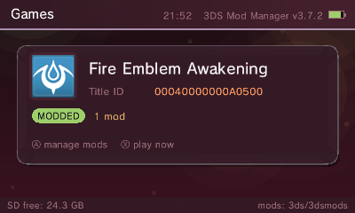
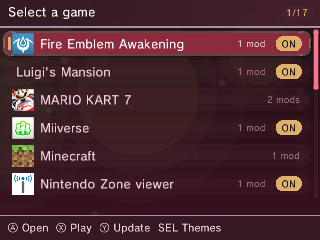
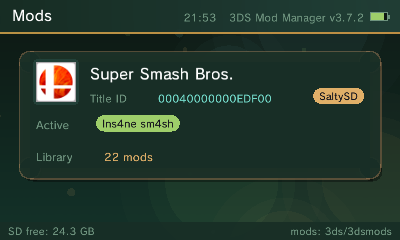
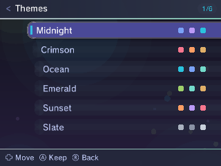

# 3DS Mod Manager

A homebrew mod manager for the Nintendo 3DS that hot-swaps game mods on the
console itself — no PC required after setup. Built with libctru + citro2d.
Works on every model (old/New 3DS/2DS) with Luma3DS. MIT licensed.

> **LLM-generated content: Yes.** This app was written with AI assistance
> (Anthropic's Claude); a human (Felipezwp) directs development and tests
> every release on real hardware.

## Screenshots

| Game view (Crimson theme) | Game list |
| --- | --- |
|  |  |

| Smash mods (Emerald + SaltySD) | Theme picker |
| --- | --- |
|  |  |

## Install (any CFW 3DS, old and New models)

1. Download `3dsmods.cia` from the
   [latest release](https://github.com/Felipezwp/3ds-mod-manager/releases/latest)
   and install it with FBI. Requirements: Luma3DS with **game patching
   enabled** (hold SELECT at boot to check).
2. From then on the app updates itself: it checks for releases at boot and
   pressing Y installs them. Updates are RSA-signed and verified on-device
   before installing.
3. Optional: UI sounds need your console's dumped DSP firmware
   (`sdmc:/3ds/dspfirm.cdc`, dump with the DSP1 homebrew) — without it the
   app simply runs silent.

Mods go in `sdmc:/3ds/3dsmods/<TitleID>/<mod name>/` (the folder is created
on first run). For Smash, see the SaltySD notes below — the in-app
**SaltySD loader** entry (bottom of Smash's mod list) installs SaltySD v2
(a `.3gx` plugin) or picks which v1.2 `code.ips` to use.

## What it does

Games on the 3DS load mods in two very different ways, and this app handles
both behind one UI:

- **Most games (Luma LayeredFS):** the active mod lives in
  `sdmc:/luma/titles/<TitleID>/` and file reads are redirected by Luma.
- **Super Smash Bros. 3DS (SaltySD):** Smash packs its data inside `dt`/`ls`
  archives, so LayeredFS can't replace individual files. SaltySD redirects
  reads to `sdmc:/saltysd/smash/` instead. Both generations are supported
  and detected automatically:
  - **SaltySD v2** ([ha1vorsen's fork](https://github.com/ha1vorsen/SaltySD),
    a Luma 3GX plugin): each mod gets its own folder,
    `saltysd/smash/<mod>/`, and any number can be on at once. A toggles a
    mod on/off; mods switched off in the game's Tetra Menu (`is.disabled`)
    show as OFF. The manager drops v2's scan cache (`saltysd/.saltysd-*`)
    after every change so the game never boots a stale mod list.
  - **SaltySD v1.2** (a `code.ips` patch): one mod at a time, swapped in
    and out of `saltysd/smash/` as before.

  The manager keeps the loader alive (self-healing from a pristine copy)
  and un/re-wraps each mod's `romfs/` layout, since SaltySD expects the
  data folders at the top of the mod folder.

Mods are stored centrally in `sdmc:/3ds/3dsmods/<TitleID>/<mod name>/` and
swapped by folder *moves* (rename), so switching is instant and nothing is
ever deleted.

## Features

- Game list with real icons + names read from each installed title's SMDH
  (works for SD, NAND, and game-card titles), with `gamename.txt` overrides
  and an offline fallback table
- One-button mod activate / disable (vanilla) per game; on/off toggles
  for multiple mods at once under SaltySD v2
- **Tidy** rescues legacy layouts: loose `luma/titles/<TID>_<mod>` folders,
  `Disabled<TID>` folders, ModMoon slots, stray `saltysd/Slot_N` folders,
  mods stranded in the SaltySD loader folder, and an old v1 layout left in
  `saltysd/smash` after moving to SaltySD v2
- 6 color themes (SELECT to switch, persisted to SD)
- Fully animated citro2d UI at 60 fps: eased selection, screen transitions,
  auto-dismissing toasts, aurora background — all batched GPU quads
- Boot-time SMDH diagnostics log (`sdmc:/3ds/3dsmods/namelookup.log`)

## Controls

| Button | Action |
| ------ | ------ |
| D-pad  | Move |
| A      | Open game / activate mod (SaltySD v2: toggle on/off) |
| X      | Disable mods (vanilla) / all off |
| Y      | Tidy legacy folders into the repo |
| B      | Back |
| SELECT | Theme picker |
| START  | Exit |

## Building

Requires devkitPro (devkitARM + libctru + citro2d) plus Steveice10's
`bannertool` and `makerom` on PATH for the CIA:

```
make        # 3dsx
make cia    # installable CIA
```

On Windows, run make from devkitPro's msys2 shell:

```
/c/devkitPro/msys2/usr/bin/bash -lc 'cd "<path to repo>" && make && make cia'
```

## SaltySD notes (hard-won)

### v2 (recommended)

1. Download the release `.3gx` from
   [ha1vorsen/SaltySD](https://github.com/ha1vorsen/SaltySD/releases):
   `saltysd_usa.3gx` for USA Smash, `saltysd_eur_jpn.3gx` for EUR/JPN.
2. Copy it to the SD root (or `3ds/3dsmods/<SmashTID>/`).
3. Open Smash in the manager -> **SaltySD loader...** -> pick the `v2`
   entry. It is installed as `luma/plugins/<SmashTID>/saltysd.3gx`, kept
   as a pristine copy in the repo, and the old `code.ips` is parked in the
   repo so Luma stops applying it.
4. Turn on Rosalina's **Plugin Loader** (L+Down+Select). The mod menu
   warns while it is off.
5. If your previous v1 mod is still sitting in `saltysd/smash`, it shows
   as **OLD v1**: A converts it into its own v2 mod folder in place, Y
   tidies it into the repo.

To go back to v1, pick a `code.ips` in the same picker; the plugin gets
parked and the v2 mod folders go back to the repo.

**Newer cartridges:** if your Smash cartridge's title version is higher
than the installed update's (FBI -> Titles shows both; e.g. cart 35840 vs
update 35296), the console runs the cartridge's own code, and the official
v2 release can't patch it: Luma loads it (blue flash) but nothing happens.
The manager detects this and warns. The fix is to build v2 yourself from
your cartridge's code: GodMode9 -> `[C:] GAMECART` -> the `.3ds` ->
Extract .code, then follow the fork's
[PATCHING.md](https://github.com/ha1vorsen/SaltySD/blob/master/smash/PATCHING.md)
(needs devkitARM, armips and Python) and pick the resulting `.3gx` in the
loader menu.

### v1.2

- The SaltySD loader `code.ips` must match the exact game code revision.
  The official GitHub v1.2 USA build does not match every cart/update
  combo (hooks can be shifted, e.g. +0x24) and a mismatch crashes at boot;
  loaders bundled with older mod packs may be the matching ones. If Smash data-aborts at boot with a register
  holding an ARM opcode (e.g. `0xE8BD8070`), suspect loader/game mismatch.
- The manager keeps a pristine loader at `3ds/3dsmods/<SmashTID>/code.ips`
  and restores `luma/titles/<SmashTID>/code.ips` from it whenever missing.
- Smash needs update 1.1.7 installed and Luma "Enable game patching" on.
- USA, EUR and JPN Smash are recognized out of the box; other
  SaltySD-based games can be added by listing their Title IDs, one per
  line, in `sdmc:/3ds/3dsmods/saltysd.txt`.
- The **SaltySD loader** entry at the bottom of a SaltySD game's mod list
  opens a picker of every `code.ips` and `.3gx` on the card (repo copies,
  SD root, active mod's, each stored mod's) and installs your choice — the
  cure for loader/revision mismatches, and how you switch generations.

## License

MIT — see [LICENSE](LICENSE).

## Credits

- [SaltySD](https://github.com/shinyquagsire23/SaltySD) by shinyquagsire23,
  and [SaltySD v2](https://github.com/ha1vorsen/SaltySD) by ha1vorsen
- devkitPro / libctru / citro2d
- Built collaboratively with Claude Code
